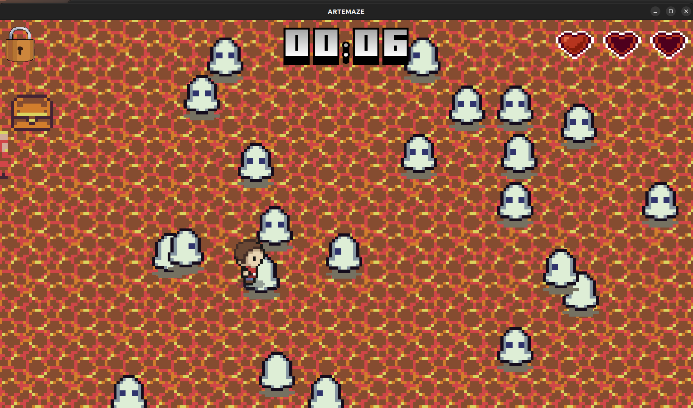

# Artemaze

The following repository contains our videogame ```Artemaze```, a 2D, pixel-art styled video game developed using the Java LibGDX framework. This game features a player navigating through a maze filled with static and movable obstacles, including enemies and spike traps. The player must then avoid all of these dangers to obtain a key from a chest hidden in the maze, so that he can then escape through exits present in the maze's map.

## Screenshots/Demo




## Features

- **Player**: The main character that the user controls.
- **Enemies**: Dynamic obstacles that move around the maze.
- **Obstacles**: Static and movable gameElements that the player must avoid or overcome.
- **Cutscene Effects**: Simple animations that enhance the gameplay aspect of the game.
- **Damage Animations**: Visual animations that occur when the player takes damage.
- **Pathfinding Algorithm**: An algorithm that allows enemies to navigate the maze intelligently.
- **Precise Collisions**: Collision detection using squared polygons for high precision.
- **Score system**: A score is assigned depending on how quickly the current level was completed. The player can observe the elapsed time at all times during the game session, a high score is also saved for each session.
- **Custom levels**: Different tiles sets are used for building different levels.


## Implementation

The game is built using Object-Oriented Programming (OOP). The codebase consists of a mix of original code and adaptations from various resources such as the LibGDX wiki, Stack Overflow, and some more for the more complex algorithms, e.g. the custom movement of the camera based on map-chunk partitioning and the pathfinding algorithm.
Credits are given to the appropriate original authors of the code e.g [@Nathan sweet](https://github.com/NathanSweet) author of libgdx

## Getting Started

To get started with ```Artemaze```, you'll need to have ```JDK17``` and a ```JRE```. Once the repository is cloned, you can open the project in your preferred ```Java IDE``` and run the ```main class``` to start the game i.e the file in the code snippet below.
The Game runs correctly on windows and linux. The mac version of the game wasn't tested.

```java
public class DesktopLauncher {
	/**
	 * The main method sets up the configuration for the game window and starts the application.
	 *
	 * @param arg Command line arguments (not used in this application)
	 */
	public static void main(String[] arg) {
		// Configuration for the game window
		Lwjgl3ApplicationConfiguration config = new Lwjgl3ApplicationConfiguration();
        
        // some more code

    }
}
```

## License

Artemaze is open-source software licensed under the ```MIT license```.... lol.

## Developers

This game was developed by TUM Heilbronn BIE students ```@Marc Tagne``` and ```@Oscar Navarro``` as an assignment for the module "Fundamentals of Programming".